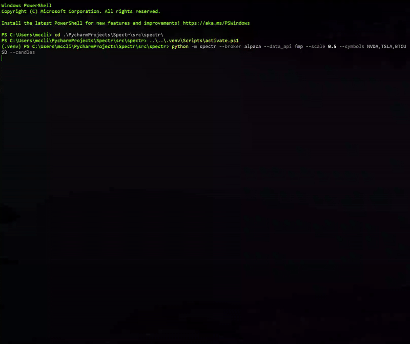
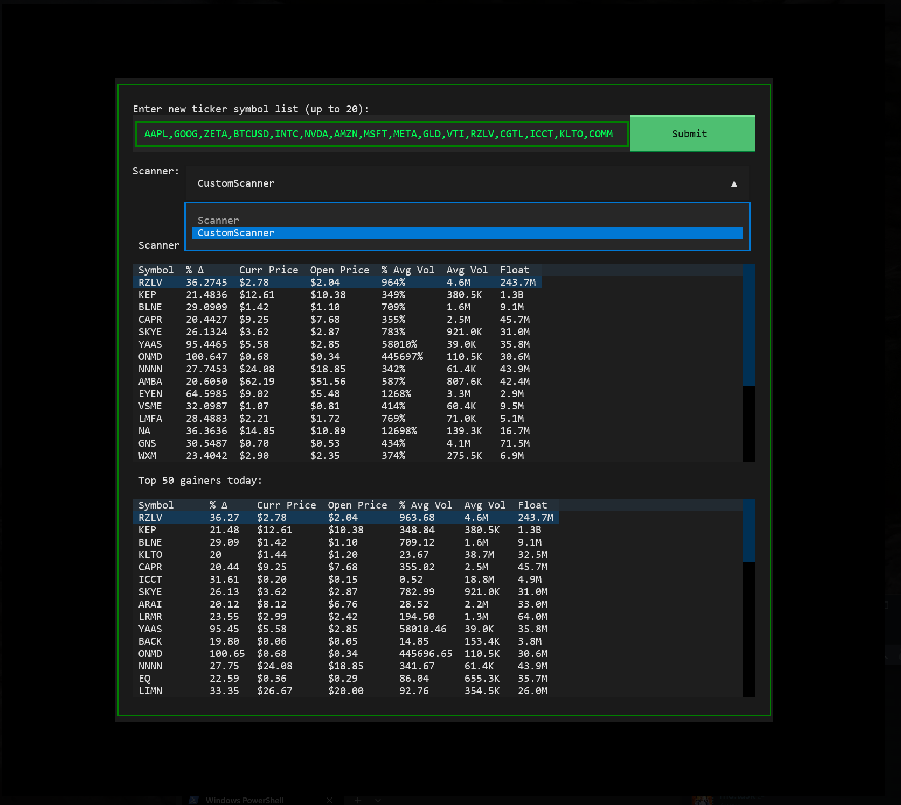

# 📈 spectr — Terminal-based Algo-Trading Terminal

---

# Disclaimer

EARLY DEVELOPMENT! DO NOT USE FOR REAL TRADING!

WAIT FOR 1.0 RELEASE!

This software is for educational purposes only. Do not risk money which you are afraid to lose. USE THE SOFTWARE AT YOUR OWN RISK. THE AUTHORS AND ALL AFFILIATES ASSUME NO RESPONSIBILITY FOR YOUR TRADING RESULTS.

---

**Spectr** is a terminal-based algorithmic trading terminal. It supports live-monitoring w/ algo-based auto-trading and historical backtesting. Supports Robinhood, Alpaca, and FMP.

BYOS - Bring Your Own Strategy. You must implement your own trading strategy in strategies/custom_strategy.py.




---

## ✨ Features

- 📈 Real-time price monitoring with interactive charts.
- 📈 Advanced hot-keys for quick sells of current position: 100% - `Ctrl+Z`, 50% - `Ctrl+X`, and 25% - `Ctrl+C`.
-  ⌨ Cycle through unlimited # of symbols with 0-9 keys or + / - keys.
- 🤖 Arm / dis-arm auto-trading with `Ctrl+A`
- 🔄 Change symbols list with `~` or `T`
- 💾 Symbols list automatically saved between sessions
- 📌 Any stocks you currently own are automatically prepended to the watchlist
- 🔄 Click symbols in Top Gainers list to add to watchlist.
- 🔄 Scanner that filters top 50 gainers for favorable conditions.
- 💵 See portfolio info + open / pending orders with `P`.
- 💵 Specify a default Trade Amount from the portfolio screen to pre-fill buy orders.
- 🧠 Supports MACD, Bollinger Bands, and Volume / VWAP.
- 💵 Live trading based on your custom strategy.
- 💵 Paper trading based on your custom strategy. (Alpaca-only)
- 📈 Real-time data API support (FMP)
- 👁️ Broker API support (Alpaca, Robinhood (currently broken))
- 🔁 Backtest mode with visual result playback with `b`.
- 🎤 Experimental voice agent that can answer questions and fetch the latest
  news for a stock symbol.

---

## 🤝 Broker Support

Currently focusing on Alpaca for broker and FMP for data. Robinhood currently broken / untested!

| Broker    | Real Trading | Historical Data | Notes                                                                       |
| --------- | ------------ | --------------- |-----------------------------------------------------------------------------|
| Alpaca    | ✅            | ⚠️               | Real-time data requires \$99 / month sub. See FMP for \$20-30/month option. |
| Robinhood | ⚠️            | ⚠️ (limited)     | Currently has login issues, see robin-stocks repo for info.                 |
| FMP       | ❌            | ✅               | Read-only via API key                                                       |


## ⌨️ Keyboard Shortcuts

| Shortcut | Action                              |
|----------|-------------------------------------|
| `Esc`    | Quit the app                        |
| `~ / T`  | Open ticker select + scanner dialog |
| `0-9`    | Select ticker by index              |
| `+ / -`  | Cycle through symbols list          |
| `Ctrl+A` | Arm auto-trading mode               |
| `Ctrl+Q` | Buy current ticker                  |
| `Ctrl+Z` | Sell 100% of position               |
| `Ctrl+X` | Sell 50% of position                |
| `Ctrl+C` | Sell 25% of position                |


## 📦 Installation

```bash
git clone https://github.com/Spectavi/spectr.git
cd spectr

# Recommended: use a virtual environment
python3 -m venv .venv
source .venv/bin/activate

pip install -r requirements.txt
```
# Usage
```bash
python -m spectr --broker alpaca --data_api fmp --scale 0.5 --symbols NVDA,TSLA,BTCUSD --candles
```


| Flag                | Description                                             |
|---------------------|---------------------------------------------------------|
| `--symbols`         | List of stock tickers to track (e.g., NVDA,AAPL,BTCUSD). If omitted, last used list is loaded from cache. |
| `--broker`          | `alpaca` or `robinhood`                                 |
| `--data_api`        | `alpaca`, `fmp`, or `robinhood`                         |
| `--real_trades`     | If set, will place real trades.                         |
| `--macd_thresh`     | Threshold for MACD crossover (default: 0.1)             |
| `--bb_period`       | Bollinger Band period (default: 200)                    |
| `--bb_dev`          | Bollinger Band std deviation (default: 2.0)             |
| `--stop_loss-pct`   | Stop loss percent.                                      |
| `--take_profit_pct` | Take profit percent.                                    |
| `--scale`           | Scale the terminal UI (default: 0.5)                    |
| `--candles`         | Enable candle chart mode (default: on).                               |

---------------
### Ticker Select Dialog with Scanner. Select rows to add to watchlist:


---------------

* Created by a human with the assistance of AI.
