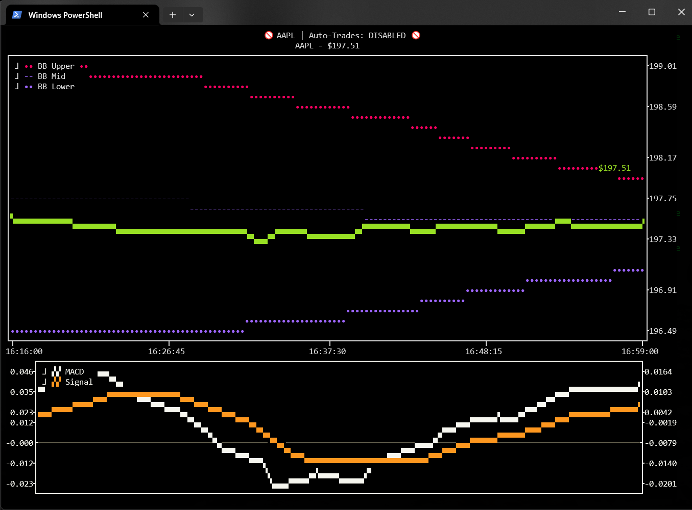
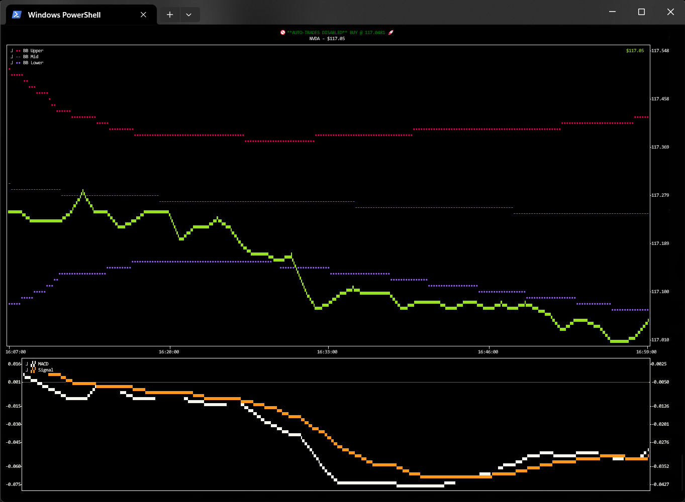
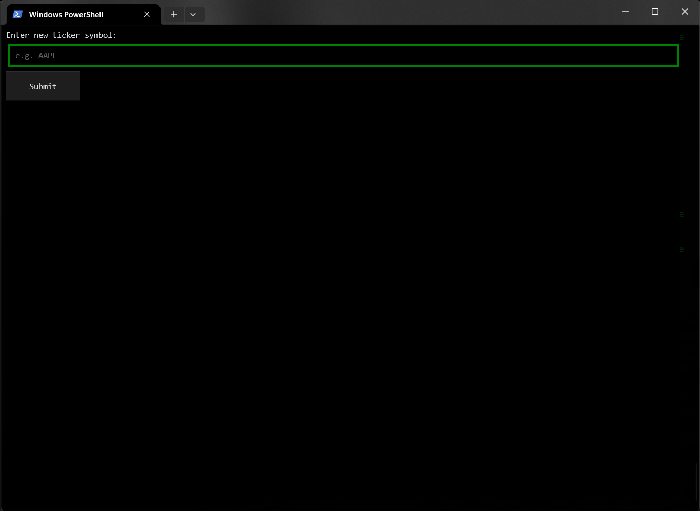

# 📈 spectr — Terminal Algo-Trading Assistant

---

## EARLY DEVELOPMENT! Use at your own risk!

---

While monitoring a stock, Ctrl+A arms / dis-arms auto-trading:



Zoom in / out using Ctrl + / - :



Change ticker symbols by pressing T:



**Spectr** is a real-time, terminal-based algorithmic trading assistant built with [Textual](https://textual.textualize.io/). It supports live-monitoring, backtesting, and auto-trading with dynamic visualization, MACD/Bollinger Band indicators, and integration with multiple brokers.

---

## ✨ Features

- 📈 Real-time price monitoring with interactive charts
- 🧠 Signal detection using MACD & Bollinger Bands
- 🔁 Backtest mode with visual result playback
- 💵 Live trading based on your custom strategy.
- 👁️ Multiple broker support (Alpaca, Robinhood, FMP)
- 🔄 Hot-switching symbols with `T`
- 🤖 Arm / dis-arm auto-trading with `Ctrl+A`

---

## 🤝 Broker Support

| Broker    | Real Trading | Historical Data | Notes                        |
| --------- | ------------ | --------------- | ---------------------------- |
| Alpaca    | ✅            | ✅               | Requires API key             |
| Robinhood | ✅            | ❌ (limited)     | Username/password login only |
| FMP       | ❌            | ✅               | Read-only via API key        |


##⌨️ Keyboard Shortcuts

| Shortcut | Action                    |
|----------| ------------------------- |
| `Esc`    | Quit the app              |
| `T`      | Enter a new ticker symbol |
| `Ctrl+A` | Toggle live trading mode  |


## 📦 Installation

```bash
git clone https://github.com/Spectavi/spectr.git
cd spectr

# Recommended: use a virtual environment
python3 -m venv .venv
source .venv/bin/activate

pip install -r requirements.txt
```
# Usage
```bash
python spectr.py --mode live --symbol AAPL --broker alpaca
```


| Flag               | Description                                 |
|--------------------|---------------------------------------------|
| `--mode`           | `live` or `backtest`                        |
| `--symbol`         | Stock ticker to track (e.g., AAPL)          |
| `--broker`         | `alpaca`, `robinhood`, or `fmp`             |
| `--real_trades`    | If set, will place real trades.             |
| `--macd_thresh`    | Threshold for MACD crossover (default: 0.1) |
| `--bb_period`      | Bollinger Band period (default: 200)        |
| `--bb_dev`         | Bollinger Band std deviation (default: 2.0) |
| `--from_date`      | Start data for backtest mode: YYYY-MM-DD    |
| `--to_date`        | End date for backtest mode: YYYY-MM-DD      |
| `--stop_loss-pct`  | Stop loss percent.                          |
| `--take_profit_pct` | Take profit percent.                        |

