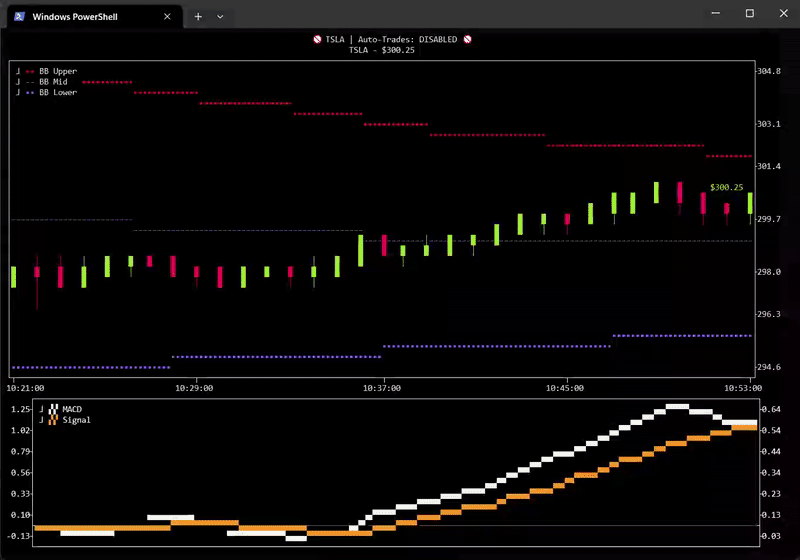
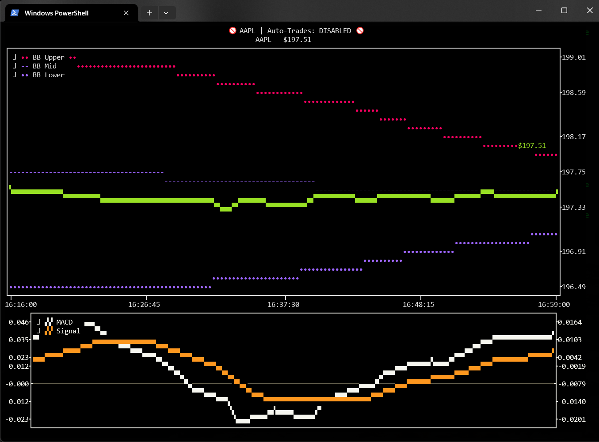
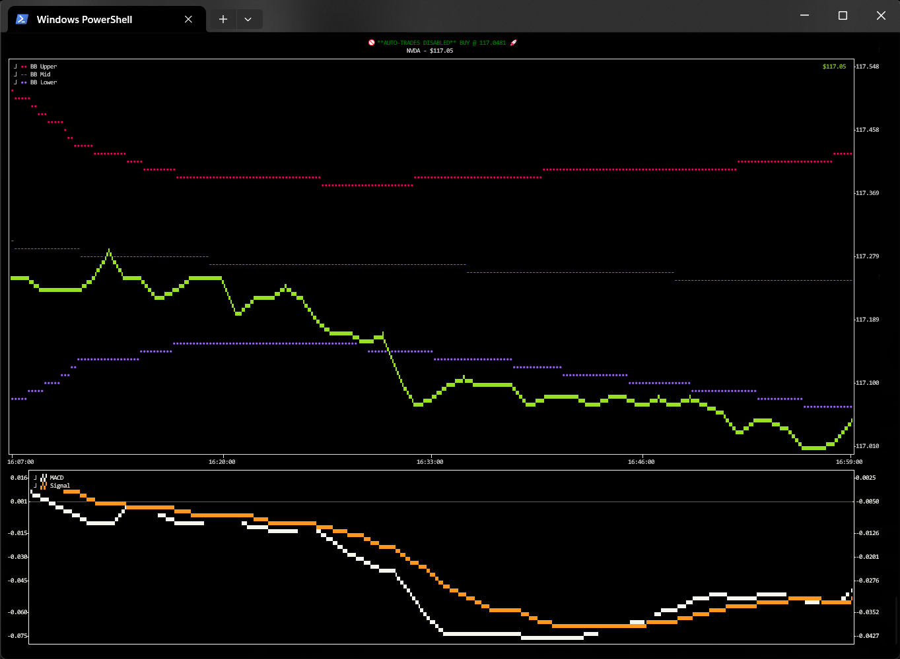
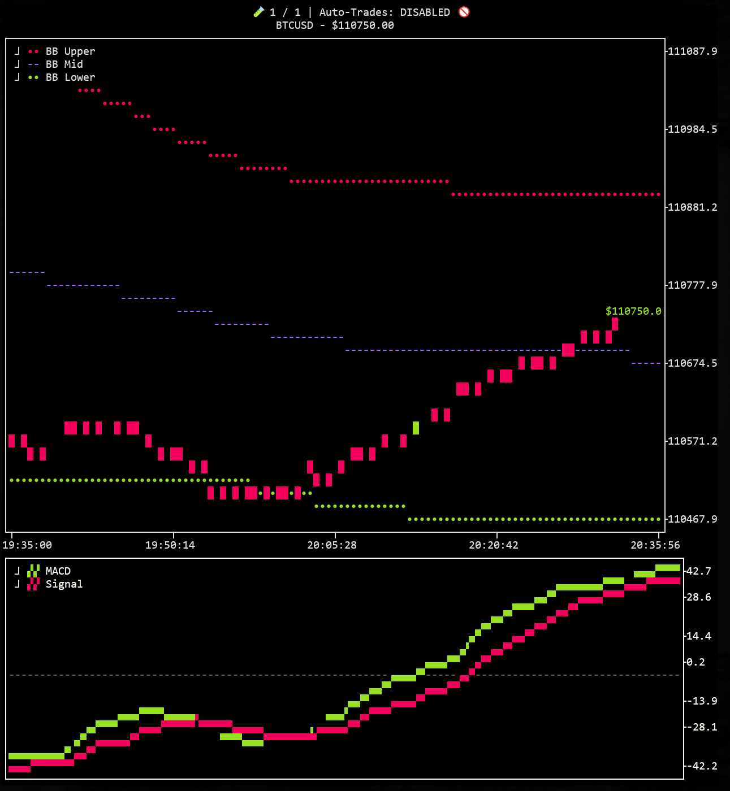

# 📈 spectr — Terminal-based Algo-Trading Terminal

---

## EARLY DEVELOPMENT! Use at your own risk!

---

**Spectr** is a terminal-based algorithmic trading terminal. It supports live-monitoring w/ algo-based auto-trading and historical backtesting via Backtrader. Supports Robinhood, Alpaca, and FMP. Multi-stock scanning and OpenAI integration are coming soon. 



While monitoring a stock, Ctrl+A arms / dis-arms auto-trading:



Zoom in / out using Ctrl + / - :



Change ticker symbols list by pressing ` / ~:




---

## ✨ Features

- 📈 Real-time price monitoring with interactive charts.
- ⌨ Cycle up to 10 stocks with 0-9 keys.
- 🤖 Arm / dis-arm auto-trading with `Ctrl+A`
- 🔄 Change symbols list with `` / ~`
- 🧠 Supports strategies w/ MACD & Bollinger Bands (all major indicators coming soon!)
- 💵 Live trading based on your custom strategy.
- 💵 Paper trading based on your custom strategy. (Alpaca-only)
- 📈 Real-time data API support (FMP)
- 👁️ Broker API support (Alpaca, Robinhood (currently broken))
- 🔁 Backtest mode with visual result playback (Under construction!)

---

## 🤝 Broker Support

Recommended to use Alpaca for broker and FMP for data.

| Broker    | Real Trading | Historical Data | Notes                                                                       |
| --------- | ------------ | --------------- |-----------------------------------------------------------------------------|
| Alpaca    | ✅            | ⚠️               | Real-time data requires \$99 / month sub. See FMP for \$20-30/month option. |
| Robinhood | ⚠️            | ⚠️ (limited)     | Currently has login issues, see robin-stocks repo for info.                 |
| FMP       | ❌            | ✅               | Read-only via API key                                                       |


##⌨️ Keyboard Shortcuts

| Shortcut | Action                    |
|----------| ------------------------- |
| `Esc`    | Quit the app              |
| `` / ~`      | Enter a new ticker symbol |
| `Ctrl+A` | Toggle live trading mode  |


## 📦 Installation

```bash
git clone https://github.com/Spectavi/spectr.git
cd spectr

# Recommended: use a virtual environment
python3 -m venv .venv
source .venv/bin/activate

pip install -r requirements.txt
```
# Usage
```bash
python src/spectr/spectr.py --broker alpaca --data_api fmp --scale 0.5 --symbols BTCUSD,NVDA --candles
```


| Flag                | Description                                 |
|---------------------|---------------------------------------------|
| `--mode`            | `live` or `backtest`                        |
| `--symbol`          | Stock ticker to track (e.g., AAPL)          |
| `--broker`          | `alpaca` or `robinhood`                     |
| `--data_api`        | `alpaca`, `fmp`, or `robinhood`             |
| `--real_trades`     | If set, will place real trades.             |
| `--macd_thresh`     | Threshold for MACD crossover (default: 0.1) |
| `--bb_period`       | Bollinger Band period (default: 200)        |
| `--bb_dev`          | Bollinger Band std deviation (default: 2.0) |
| `--from_date`       | Start data for backtest mode: YYYY-MM-DD    |
| `--to_date`         | End date for backtest mode: YYYY-MM-DD      |
| `--stop_loss-pct`   | Stop loss percent.                          |
| `--take_profit_pct` | Take profit percent.                        |

