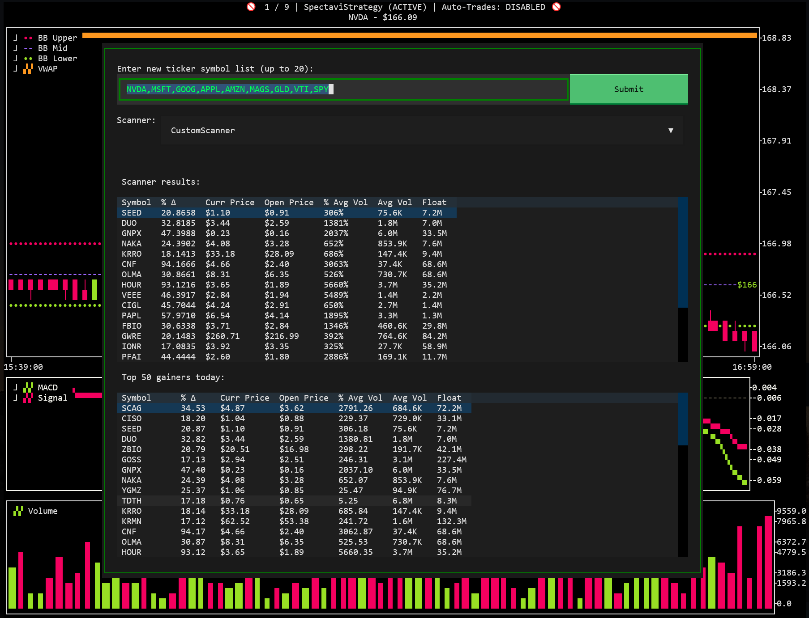

# 📈 spectr — Terminal-based Algo-Trading Terminal

---

# Disclaimer

EARLY DEVELOPMENT! DO NOT USE FOR REAL TRADING!

WAIT FOR 1.0 RELEASE!

This software is for educational purposes only. Do not risk money which you are afraid to lose. USE THE SOFTWARE AT YOUR OWN RISK. THE AUTHORS AND ALL AFFILIATES ASSUME NO RESPONSIBILITY FOR YOUR TRADING RESULTS.

---

**Spectr** is a terminal-based algorithmic trading terminal. It supports live-monitoring w/ algo-based auto-trading and historical backtesting. Supports Robinhood, Alpaca, and FMP.

BYOS - Bring Your Own Strategy. You must implement your own trading strategy in strategies/custom_strategy.py.


---

## ✨ Features

- 📈 Real-time price monitoring with interactive charts.
- 📈 Real-time data API support (FMP)
- 👁️ Broker API support (Alpaca, Robinhood (in progress))
- 🧠 Supports MACD, Bollinger Bands, and Volume / VWAP.
- 📈 Advanced hot-keys for quick sells of current position: 100% - `Ctrl+Z`, 50% - `Ctrl+X`, and 25% - `Ctrl+C`.
- 💾 Symbols list automatically saved between sessions
- 📌 Any stocks you currently own are automatically kept in the watchlist
- 🔄 Scanner that filters top 50 gainers for favorable conditions.
- 💵 Specify a default Trade Amount from the portfolio screen to pre-fill buy orders.
- 💵 Live trading based on your custom strategy.
- 💵 Paper trading based on your custom strategy. (Alpaca-only)
- 🔁 Backtest mode with visual result playback with `b`.
- 🎤 Experimental voice agent that can answer questions and fetch recent news
  articles for a stock symbol.
- 🗣 Use the voice agent to add or remove symbols from your watch list.
- 🎤 Optional real-time mode listens for the wake word "spectr".

---

## 🤝 Broker Support

Currently focusing on Alpaca for broker and FMP for data. Robinhood currently broken / untested!

| Broker    | Real Trading | Historical Data | Notes                                                                       |
| --------- | ------------ | --------------- |-----------------------------------------------------------------------------|
| Alpaca    | ✅            | ⚠️               | Real-time data requires \$99 / month sub. See FMP for \$20-30/month option. |
| Robinhood | ⚠️            | ⚠️ (limited)     | Currently has login issues, see robin-stocks repo for info.                 |
| FMP       | ❌            | ✅               | Read-only via API key                                                       |


## ⌨️ Keyboard Shortcuts

| Shortcut | Action                         |
|----------|--------------------------------|
| `Esc`    | Quit the app                   |
| `~ / T`  | Open ticker select + scanner dialog |
| `0-9`    | Select ticker by index         |
| `+ / -`  | Cycle through symbols list     |
| `P`      | Show portfolio info            |
| `B`      | Perform backtest               |
| `S`      | Show strategy info             |
| `Ctrl+A` | Arm auto-trading mode          |
| `Ctrl+Q` | Buy current ticker             |
| `Ctrl+Z` | Sell 100% of position          |
| `Ctrl+X` | Sell 50% of position           |
| `Ctrl+C` | Sell 25% of position           |


## 📦 Installation

```bash
git clone https://github.com/Spectavi/spectr.git
cd spectr

# Recommended: use a virtual environment
python3 -m venv .venv
source .venv/bin/activate

pip install -r requirements.txt
```
# Usage
```bash
pip install -e .

# After installation you can launch the UI with the `spectr` command
spectr --broker alpaca --data_api fmp --scale 0.5 --symbols NVDA,TSLA,BTCUSD --candles

# Alternatively without installing you can run
PYTHONPATH=src python -m spectr.spectr --broker alpaca --data_api fmp --scale 0.5 --symbols NVDA,TSLA,BTCUSD --candles
```


| Flag                | Description                                             |
|---------------------|---------------------------------------------------------|
| `--symbols`         | List of stock tickers to track (e.g., NVDA,AAPL,BTCUSD). If omitted, last used list is loaded from cache. |
| `--broker`          | `alpaca` or `robinhood`                                 |
| `--data_api`        | `alpaca`, `fmp`, or `robinhood`                         |
| `--real_trades`     | If set, will place real trades.                         |
| `--macd_thresh`     | Threshold for MACD crossover (default: 0.1)             |
| `--bb_period`       | Bollinger Band period (default: 200)                    |
| `--bb_dev`          | Bollinger Band std deviation (default: 2.0)             |
| `--stop_loss-pct`   | Stop loss percent.                                      |
| `--take_profit_pct` | Take profit percent.                                    |
| `--scale`           | Scale the terminal UI (default: 0.5)                    |
| `--candles`         | Enable candle chart mode (default: on).                               |
| `--voice_agent_listen` | Enable real-time voice agent listening for the wake word. |
| `--voice_agent_wake_word` | Word that triggers the voice agent (default: spectr). |
| `--voice-streaming` | Enable streaming text-to-speech for the voice agent. |
| `--reset-cache`     | Clear cached data on startup without removing saved credentials. |

---------------

### Setup Screen. Shows on initial startup or via Portfolio dialog.


### Portfolio Dialog (P key). Shows cash, positions, and pending orders:


### Ticker Select Dialog with Scanner (T key). Select rows to add to watchlist:


### Strategy Info Dialog (S key). Shows strategy signal info:


---------------

* Created by a human with the assistance of AI.
